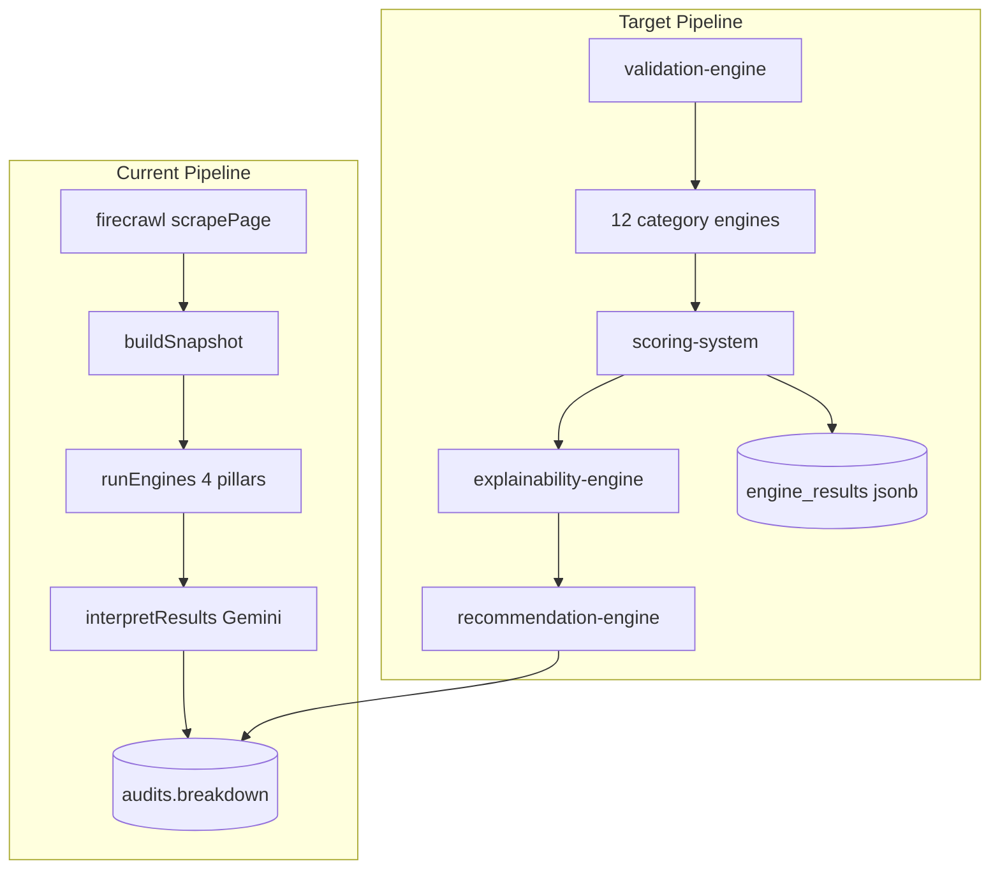

# Backend Audit Completion and Feature Implementation

## Phase 1 — Final Audit

| Component | Status |
|-----------|--------|
| Backend | ⚠️ Partial — solid pipeline (`firecrawl` → `runEngines` → `interpretResults` → Supabase) but `engine_results` stores only `{ aiEnhanced }` |
| Database | ✅ Complete — `audits` table has `breakdown`, `recommendations`, `geo_readability`, `engine_results` (jsonb); no migration required |
| APIs | ✅ Complete — audit, crawl, generate, billing, monitoring, cron, webhooks all wired |
| Analysis | ⚠️ Partial — 4 deterministic engines only ([orchestrator.ts](src/lib/engines/orchestrator.ts)) |
| AI | ⚠️ Partial — Gemini interprets rules ([interpreter.ts](src/lib/ai/interpreter.ts)); no content-quality analysis |
| Scoring | ⚠️ Partial — 4 weighted pillars (`conversion/seo/geo/trust`); no 12-category model |

**Working integrations:** [firecrawl.ts](src/lib/firecrawl.ts), [gemini.ts](src/lib/gemini.ts), [supabase.ts](src/lib/supabase.ts), [url-validation.ts](src/lib/url-validation.ts), [site-signals.ts](src/lib/engines/site-signals.ts).

---

## Phase 2 — Gap Detection

| Feature | Exists | Action |
|---------|--------|--------|
| 1. Validation Engine | Partial (`url-validation.ts` only) | **Extend Existing** — add pre-score snapshot/page validation |
| 2. Explainability Engine | Partial (rule details in engines, not surfaced) | **Create New** — `explainability-engine.ts` |
| 3. Recommendation Engine | Partial (`ai/interpreter.ts` + fallback) | **Extend Existing** — extract deterministic recs; interpreter calls it |
| 4. 12-Category Scoring | Missing (4 pillars only) | **Create New** — `scoring-system.ts` + category types |
| 5. Technical SEO Analyzers | Partial (`seo-engine.ts` ~10 rules) | **Extend Existing** — add rules; move perf rules out |
| 6. Performance Analyzers | Partial (`seo-page-weight` proxy only) | **Create New** — `performance-engine.ts` |
| 7. Accessibility Analyzers | Missing (alt-text only in SEO) | **Create New** — `accessibility-engine.ts` |
| 8. Security Analyzers | Partial (HTTPS in trust-engine) | **Create New** — `security-engine.ts` (HTML-level checks) |
| 9. Content AI Analysis | Partial (generate copy, no analysis) | **Create New** — `ai/content-analysis.ts` |
| 10. CRO Analysis | ✅ (`cro-engine.ts`) | **Extend Existing** — minor rule additions |
| 11. UX Analysis | Missing | **Create New** — `ux-engine.ts` |
| 12. UI Analysis | Missing | **Create New** — `ui-engine.ts` |
| 13. Ecommerce Analysis | Partial (price/payments in CRO, schema in GEO) | **Create New** — `ecommerce-engine.ts` |
| 14. GEO Analysis | ✅ (`geo-engine.ts`) | **Extend Existing** — minor rule additions |
| 15. Brand Analysis | Missing | **Create New** — `brand-engine.ts` |
| 16. Mobile Analysis | Missing | **Create New** — `mobile-engine.ts` |
| 17. AI Insights | Partial (`geoReadability`, `compareGaps`) | **Extend Existing** — `insights-engine.ts` |
| 18. Report Generator Upgrade | Partial ([audit-report-pdf.tsx](src/lib/pdf/audit-report-pdf.tsx) 4-pillar only) | **Extend Existing** — render categories + explainability from `engine_results` |

**Skip:** DB schema changes, new API routes, frontend pages, duplicate OAuth/billing/crawl logic.

---

## Phase 3 — Implementation Plan

### Architecture rules (no frontend breakage)

- Keep [types.ts](src/lib/types.ts) `ScorePillar` and `breakdown` as **4 pillars** (frontend depends on this).
- Add optional `AuditData.engineResults` for rich backend payload; API already returns full audit object.
- Store full analysis in existing `audits.engine_results` jsonb — **no migration**.
- Reuse `PageSnapshot` — extend [snapshot.ts](src/lib/engines/snapshot.ts) with mobile/UX signals parsed from HTML (viewport meta, form count, nav links, etc.).
- Refactor [orchestrator.ts](src/lib/engines/orchestrator.ts) to orchestrate 12 categories, then aggregate to 4 pillars via scoring system.

### 12 categories (new `ScoreCategory` in [engines/types.ts](src/lib/engines/types.ts))

| Category | Engine file | Source |
|----------|-------------|--------|
| `technical_seo` | `seo-engine.ts` (extended) | Existing — remove `seo-page-weight` (moves to performance) |
| `performance` | `performance-engine.ts` | New |
| `accessibility` | `accessibility-engine.ts` | New |
| `security` | `security-engine.ts` | New (HTTPS, mixed content, form security) |
| `content` | `content-engine.ts` | New deterministic + optional Gemini |
| `cro` | `cro-engine.ts` | Existing |
| `ux` | `ux-engine.ts` | New |
| `ui` | `ui-engine.ts` | New |
| `ecommerce` | `ecommerce-engine.ts` | New (cart, variants, schema, checkout) |
| `geo` | `geo-engine.ts` | Existing |
| `brand` | `brand-engine.ts` | New |
| `mobile` | `mobile-engine.ts` | New |

### Layer modules (new under `src/lib/engines/`)

1. **`validation-engine.ts`** — validate scraped page: min content length, required HTML fields, blocked/empty snapshot; return warnings (non-blocking) + errors (blocking).
2. **`scoring-system.ts`** — run all 12 category engines; compute `categoryScores[]`; aggregate to 4 `EngineResult` pillars using fixed weight map; compute `overallScore`.
3. **`explainability-engine.ts`** — map failed/partial rules → `{ ruleId, category, label, evidence, pointsLost, suggestedFix }`.
4. **`recommendation-engine.ts`** — deterministic recommendations from explainability (extracted from `buildFallbackInterpretation` in [interpreter.ts](src/lib/ai/interpreter.ts)); Gemini interpreter enriches, does not replace.
5. **`insights-engine.ts`** — combine `geoReadability`, category top/bottom 3, competitor deltas → `AIInsight[]`.

### AI content analysis

- Add [src/lib/ai/content-analysis.ts](src/lib/ai/content-analysis.ts): optional Gemini JSON scoring for tone, clarity, keyword coverage — **supplements** deterministic `content-engine`, falls back when Gemini unavailable (same pattern as [ai/client.ts](src/lib/ai/client.ts)).

### Pipeline wiring (minimal touch points)

| File | Change |
|------|--------|
| [gemini.ts](src/lib/gemini.ts) `runAudit` | Call validation → scoring-system → explainability → recommendation-engine → content-analysis → insights; return `engineResults` on `AuditData` |
| [orchestrator.ts](src/lib/engines/orchestrator.ts) | Delegate to `scoring-system.ts`; keep export signature for crawl compat |
| [ai/interpreter.ts](src/lib/ai/interpreter.ts) | Import recommendation-engine fallback; accept 12-category context in prompt |
| [api/audit/route.ts](src/app/api/audit/route.ts) | Persist full `engine_results` object (not just `aiEnhanced`) |
| [audit/map-audit.ts](src/lib/audit/map-audit.ts) | Map `engine_results` → `AuditData.engineResults` |
| [types.ts](src/lib/types.ts) | Add optional `engineResults`, `categoryBreakdown` types |
| [pdf/audit-report-pdf.tsx](src/lib/pdf/audit-report-pdf.tsx) | Add category grid + top explainability items when `engineResults` present |
| [crawl/analyze-page.ts](src/lib/crawl/analyze-page.ts) | No signature change; benefits automatically via orchestrator |

### Pillar aggregation weights (12 → 4, for frontend `breakdown`)

- **conversion** ← cro (40%), ux (25%), ui (20%), ecommerce (15%)
- **seo** ← technical_seo (50%), performance (30%), content (20%)
- **geo** ← geo (70%), content (30%)
- **trust** ← security (35%), brand (35%), accessibility (30%)

### Implementation order (matches user list)

Execute sequentially; run `npx tsc --noEmit` after each batch.

1. Types + snapshot extensions
2. Validation engine
3. Explainability engine
4. Recommendation engine (refactor interpreter)
5. Scoring system + 12 category engines (new 8, extend 4)
6. Wire orchestrator + gemini pipeline
7. Content AI analysis + insights engine
8. Persist `engine_results` in API + map-audit
9. PDF report upgrade
10. Dead import cleanup + TypeScript check

### Files to create (~10)

- `src/lib/engines/scoring-system.ts`
- `src/lib/engines/validation-engine.ts`
- `src/lib/engines/explainability-engine.ts`
- `src/lib/engines/recommendation-engine.ts`
- `src/lib/engines/insights-engine.ts`
- `src/lib/engines/performance-engine.ts`
- `src/lib/engines/accessibility-engine.ts`
- `src/lib/engines/security-engine.ts`
- `src/lib/engines/content-engine.ts`
- `src/lib/engines/ux-engine.ts`
- `src/lib/engines/ui-engine.ts`
- `src/lib/engines/ecommerce-engine.ts`
- `src/lib/engines/brand-engine.ts`
- `src/lib/engines/mobile-engine.ts`
- `src/lib/ai/content-analysis.ts`

### Files to modify (~12)

- `src/lib/engines/types.ts`, `snapshot.ts`, `orchestrator.ts`, `seo-engine.ts`
- `src/lib/gemini.ts`, `src/lib/ai/interpreter.ts`
- `src/lib/types.ts`, `src/lib/audit/map-audit.ts`
- `src/app/api/audit/route.ts`
- `src/lib/pdf/audit-report-pdf.tsx`

### Expected final report shape

**Completed:** All 18 features (via extension, not duplication).

**Remaining:** Frontend wiring to display 12 categories (out of scope).

**Ready for Frontend:** YES — existing 4-pillar UI unchanged; optional `engineResults` / `categoryBreakdown` available for incremental UI work.
