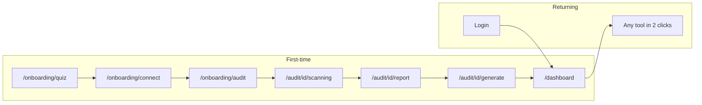

# SaaS Workflow Reorganization

## Current state (gaps)

- Auth app uses a **flat top navbar** in [`src/components/app/page-shell.tsx`](src/components/app/page-shell.tsx) (Dashboard, New Audit, History, Watch, Settings + Content Improver). Unused shadcn [`src/components/ui/sidebar.tsx`](src/components/ui/sidebar.tsx) and [`src/components/ui/breadcrumb.tsx`](src/components/ui/breadcrumb.tsx) already exist.
- Onboarding is a **single quiz** at `/onboarding` → redirects to `/dashboard`. No connect-website step; no step resume. Completion = 6 quiz keys in `profiles.onboarding` JSONB ([`src/lib/onboarding/validate.ts`](src/lib/onboarding/validate.ts)).
- Only scanning → report auto-advances. Report → Customer Eye → Fixes → Generate → Export is **manual**.
- Dashboard has stats/plan/recent audits but **no quick-action grid**. Empty copy is inconsistent and weak.

## Design-lock interpretation (committed)

- **Do not** change global CSS, marketing chrome, or Tailwind classes on existing content components (IssueCard, ScoreRadial, report sections, etc.).
- **Do** change app chrome structure as required: replace flat top nav links with hierarchical sidebar using existing shadcn Sidebar + **the same link classNames** already used in PageShell (`px-3.5 py-2 text-sm …`).
- Keep a slim top strip for Logo / language / theme / logout (already present). Content pages keep `PageHeader` / `PageContent`.

## Target information architecture

### Sidebar hierarchy (PageShell only)

| Group | Label | Route |
|-------|-------|-------|
| Overview | Dashboard | `/dashboard` |
| Analysis | New Audit | `/audit/new` |
| Analysis | Reports | `/reports` (new thin page) |
| Analysis | History | `/history` |
| AI | AI Center | `/ai` (new hub) |
| Monitoring | Website Monitoring | `/watch` |
| Monitoring | Notifications | `/watch/alerts` |
| Business | Pricing | `/pricing` |
| Business | Billing | `/settings/billing` |
| Account | Settings | `/settings` |

Preserve existing deep links: `/tools/content-improver`, `/audit/[id]/generate`, `/audit/[id]/compare` (reachable from AI Center / report / quick actions).

---

## 1. Flow state in profile (no new table)

Reuse `profiles.onboarding` JSONB. Extend keys (string values) — **no new column** unless middleware typing needs it:

| Key | Purpose |
|-----|---------|
| existing quiz keys | unchanged |
| `flowStep` | `quiz` \| `connect` \| `audit` \| `scanning` \| `report` \| `customerEye` \| `priorityFixes` \| `recommendations` \| `generate` \| `export` \| `done` |
| `connectedWebsite` | canonical store URL |
| `lastAuditId` | latest audit id |
| `flowComplete` | `"true"` when guided first-run finished |

Also mirror `lastAuditId` + `connectedWebsite` in **localStorage** (`convaudit:lastAuditId`, `convaudit:connectedWebsite`).

Update:
- [`src/app/api/onboarding/route.ts`](src/app/api/onboarding/route.ts) — PATCH/POST accepts partial flow fields; quiz POST sets `flowStep: connect`
- [`src/app/api/profile/route.ts`](src/app/api/profile/route.ts) — GET returns flow fields for dashboard/resume
- [`src/lib/onboarding/validate.ts`](src/lib/onboarding/validate.ts) — `isQuizComplete()`, `getFlowStep()`, `isGuidedFlowComplete()` (`flowComplete === "true"`)

**Middleware** ([`src/lib/supabase/middleware.ts`](src/lib/supabase/middleware.ts)):
- Incomplete **quiz** → `/onboarding/quiz` (same as today for protected routes)
- Quiz done but `flowComplete !== "true"` → redirect to `/onboarding/{flowStep}` (map scanning/report/… to the matching audit route when `lastAuditId` exists)
- `flowComplete` → allow dashboard; visiting `/onboarding/*` → dashboard
- Add `/reports`, `/ai`, `/tools` to `PROTECTED_PATHS`

---

## 2. Onboarding routes (`/onboarding/[step]`)

| Step | Implementation |
|------|----------------|
| `quiz` | Existing [`SiteQuiz`](src/components/onboarding/site-quiz.tsx); on success save + `flowStep=connect` → `/onboarding/connect`. Show **Resume** if quiz partially saved (persist mid-quiz answers via API on each answer). |
| `connect` | New thin form: URL input using existing [`url-validation`](src/lib/url-validation.ts) patterns from [`audit/new`](src/app/audit/new/page.tsx). Save `connectedWebsite` → `flowStep=audit` → `/onboarding/audit` |
| `audit` | Prefills URL; CTA starts audit (reuse `/audit/new` submit logic or redirect to `/audit/new?url=…&guided=1`). On start → `flowStep=scanning`, set `lastAuditId` → existing scanning page |

Keep [`src/app/onboarding/page.tsx`](src/app/onboarding/page.tsx) as redirect → `/onboarding/quiz`. Layout stays `AuthShell`.

---

## 3. Auto-advance (wrap existing pages; no API contract changes)

| Trigger | Action |
|---------|--------|
| Quiz saved | → `/onboarding/connect` |
| Website validated | → `/onboarding/audit` |
| Audit API started | → scanning (already) + persist `lastAuditId` |
| Scanning 100% | → report (already) + `flowStep=report` |
| Report mount (guided) | scroll/highlight Customer Eye; sticky **Continue** sets `customerEye` |
| Customer Eye Continue / scroll end | scroll to Priority Fixes band |
| Priority Fixes **Apply Fixes** | scroll to AI Recommendations + `flowStep=recommendations` |
| **Generate Content** | → `/audit/[id]/generate` |
| Generate **Continue** | focus Export (PDF) CTA |
| PDF download / Share | `flowComplete=true` → `/dashboard` |

**Report page** ([`src/app/audit/[id]/report/page.tsx`](src/app/audit/[id]/report/page.tsx)): add a guided-flow wrapper only when `flowComplete !== "true"`. Do **not** reorder/restyle sections.

**Priority Fixes mapping (no new engine):** render a labeled band above the existing recommendations grid that lists critical/high `IssueCard`s already on the page (same component, same classes). “Apply Fixes” is a Continue CTA, not a new mutation.

**Returning users:** skip guided sticky CTA when `flowComplete === "true"`.

---

## 4. Dashboard quick actions + usage + monitoring prompt

Update [`src/app/dashboard/page.tsx`](src/app/dashboard/page.tsx):

1. **8 quick-action cards** (reuse existing card/button patterns already on the page — same border/radius/typography as plan/recent cards):
   - New Audit → `/audit/new`
   - Continue Last Audit → `/audit/{lastAuditId}/report` or scanning if incomplete
   - Reports → `/reports`
   - AI Center → `/ai`
   - Competitor Analysis → `/audit/{lastId}/compare` if competitor data else `/audit/new` (competitor field)
   - Website Monitoring → `/watch`
   - History → `/history`
   - Billing → `/settings/billing`

2. **Usage widget** — lift existing plan/usage meters (already partially present) into an explicit audits / AI generations / monitoring summary (data from `usage_counters` + monitoring count; same queries style as today).

3. **Monitoring prompt** — if user has zero monitoring jobs, after 3s show existing toast with CTA → `/watch` (once per session via `sessionStorage`).

4. Replace empty recent-audits copy with value + CTA per empty-state rules.

---

## 5. Breadcrumbs

Add [`src/components/app/app-breadcrumb.tsx`](src/components/app/app-breadcrumb.tsx) wrapping unused shadcn Breadcrumb.

Integrate into `PageHeader` (optional `crumbs` prop) so every `PageShell` page shows:

`Dashboard > [Section] > [Page]`

Route → crumb map in one config file [`src/lib/nav-config.ts`](src/lib/nav-config.ts) (also drives sidebar). Wire on dashboard, audit/*, history, reports, ai, watch/*, settings/*, tools/*.

---

## 6. Empty states

Add [`src/components/app/empty-state.tsx`](src/components/app/empty-state.tsx): title + CTA button only (reuse `Button` + `text-muted-foreground`). Apply prescribed copy to dashboard, `/reports`, `/history`, `/watch`, `/ai`. Never use the words “empty” or “nothing”.

---

## 7. New thin pages (hubs only)

| New file | Role |
|----------|------|
| `src/app/reports/page.tsx` | Lists completed audits → report links (reuse history fetch pattern); breadcrumb Analysis > Reports |
| `src/app/ai/page.tsx` | AI Center: links to Content Improver, Continue generate from `lastAuditId`, optional deep link to geo tools; pre-fill context from last audit when opening generate |
| `src/app/onboarding/[step]/page.tsx` | Step router for quiz/connect/audit |
| `src/lib/nav-config.ts` | Single source for sidebar + breadcrumbs |
| `src/lib/workflow/flow-state.ts` | Helpers: read/write flowStep, localStorage sync |
| `src/components/app/app-sidebar.tsx` | Hierarchical sidebar menu |
| `src/components/app/app-breadcrumb.tsx` | Breadcrumb UI |
| `src/components/app/empty-state.tsx` | Shared empty state |
| `src/components/app/quick-actions.tsx` | Dashboard 8-card grid |
| `src/components/audit/guided-flow-rail.tsx` | Sticky Continue / step progress on report+generate during first run |

**Do not** create a Tools directory page. **Do not** move existing route handlers.

---

## 8. PageShell change (core)

Refactor [`page-shell.tsx`](src/components/app/page-shell.tsx):
- Wrap authenticated layout in `SidebarProvider` + `AppSidebar`
- Replace desktop `NAV` / `AI_TOOLS_NAV` flat links with sidebar groups from `nav-config`
- Mobile: sidebar sheet (shadcn built-in) instead of current hamburger link list (same destinations)
- `PageHeader`: add breadcrumb row above title when `crumbs` provided; keep existing back link behavior where already used (can coexist)

i18n: add keys for new labels (Reports, AI Center, Monitoring, Notifications, Billing, section headers, empty states, Resume) in [`src/lib/i18n.ts`](src/lib/i18n.ts) only — no visual redesign.

---

## File structure diff

**New**
- `src/lib/nav-config.ts`
- `src/lib/workflow/flow-state.ts`
- `src/components/app/app-sidebar.tsx`
- `src/components/app/app-breadcrumb.tsx`
- `src/components/app/empty-state.tsx`
- `src/components/app/quick-actions.tsx`
- `src/components/audit/guided-flow-rail.tsx`
- `src/app/reports/page.tsx`
- `src/app/ai/page.tsx`
- `src/app/onboarding/[step]/page.tsx`

**Modified (behavior/wiring only)**
- `src/components/app/page-shell.tsx` — sidebar chrome
- `src/app/dashboard/page.tsx` — quick actions, usage, empty, monitoring toast
- `src/app/onboarding/page.tsx` — redirect to `/onboarding/quiz`
- `src/components/onboarding/site-quiz.tsx` — persist step, Resume, advance to connect
- `src/app/audit/new/page.tsx` — accept prefill URL / guided flag
- `src/app/audit/[id]/scanning/page.tsx` — persist lastAuditId + flowStep
- `src/app/audit/[id]/report/page.tsx` — guided rail + priority band CTA
- `src/app/audit/[id]/generate/page.tsx` — Continue → export → dashboard
- `src/app/history/page.tsx`, `src/app/watch/page.tsx`, settings pages — breadcrumbs + empty states
- `src/app/api/onboarding/route.ts`, `src/app/api/profile/route.ts`
- `src/lib/onboarding/validate.ts`
- `src/lib/supabase/middleware.ts` — step-aware redirects + protect `/reports`, `/ai`
- `src/lib/i18n.ts` — new strings

**Unchanged**
- All `/api/audit`, `/api/generate`, `/api/monitoring`, billing/checkout, engines, global CSS, marketing pages, Tailwind on existing report widgets

---

## Success criteria mapping

| Metric | How delivered |
|--------|----------------|
| First audit &lt; 5 min without nav decisions | Auto-advance quiz → connect → audit → scan → report → generate → export → dashboard |
| Any tool ≤ 2 clicks | Dashboard 8 quick actions + grouped sidebar |
| Resume interrupted onboarding | `flowStep` + Resume CTA on `/onboarding/[step]` |
| Features preserved | No route/API removals; hubs only add entry points |
